# Classification model competition

### Our goals are:
- Choose best hyperparameters for each of the model. To solve this problem we will use cross-validation;
- Compare three models for their ability to classify bad customers;
- Log all this manipulations to mlflow to have the opportunity to compare multiple metrics and to use best of these to the production

### Basic tools
- pyspark in jupyter notebook container - the opportunity to work with Big Data without rewritting the code;

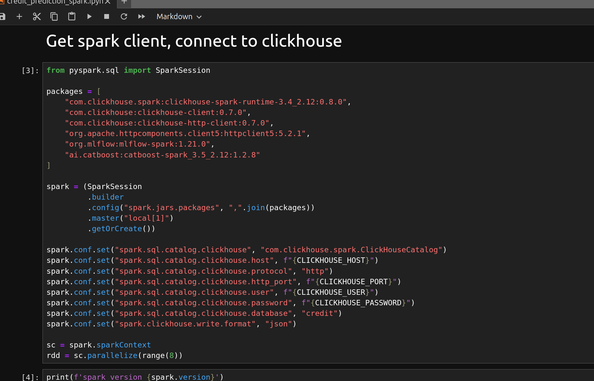

- mlflow - logging all the parameters, metrics and models due to experiments;

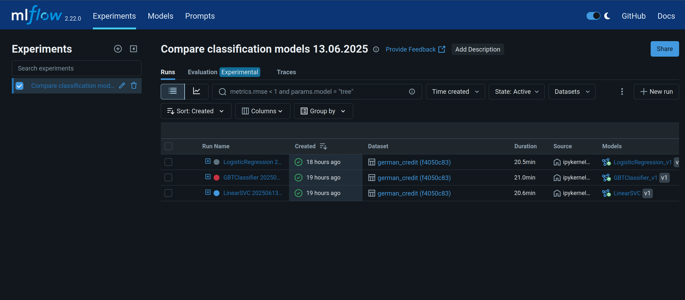

- minio - s3 storage to store artifacts and models;

## Jupyter notebook
In jupyter we create a pipeline, ..

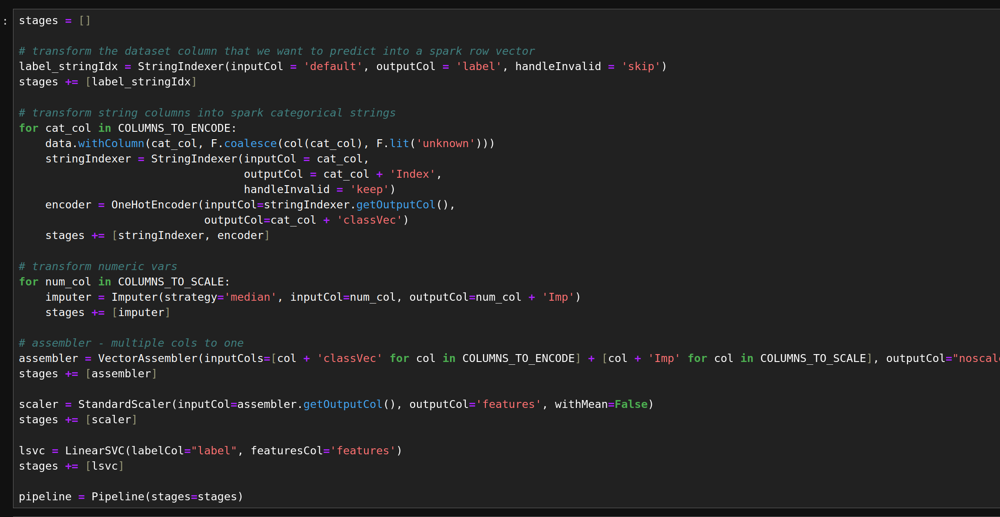

.. create params grid to search best hyperparams, set evaluator and estimator for each model, ..

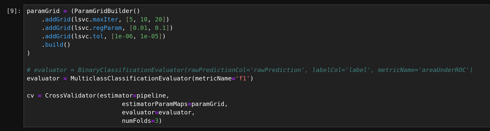

.. connect to mlflow, ..

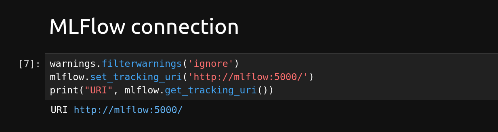

.. then log params, metrics, models to mlflow, ..

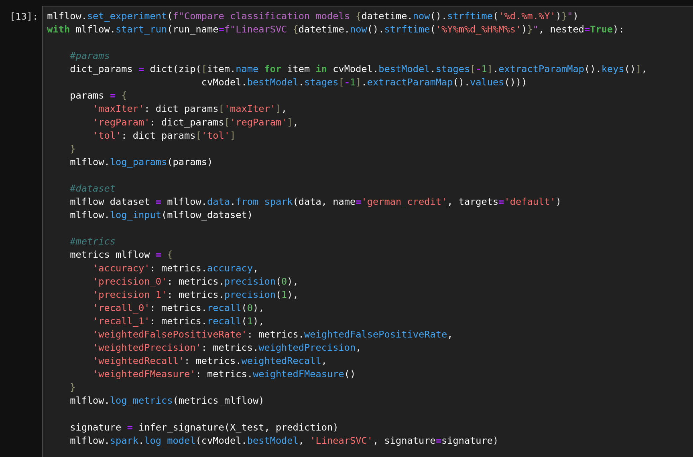
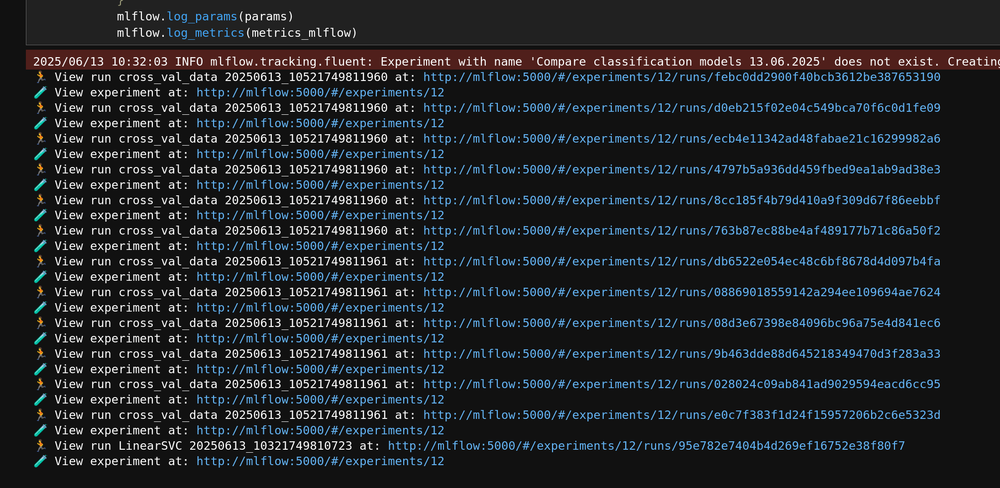

## Mlflow

In mlflow we log metrics and params, ..

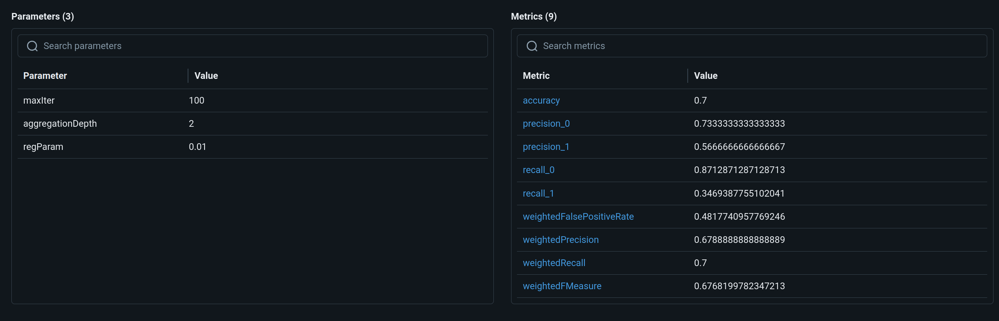

dataset. ..

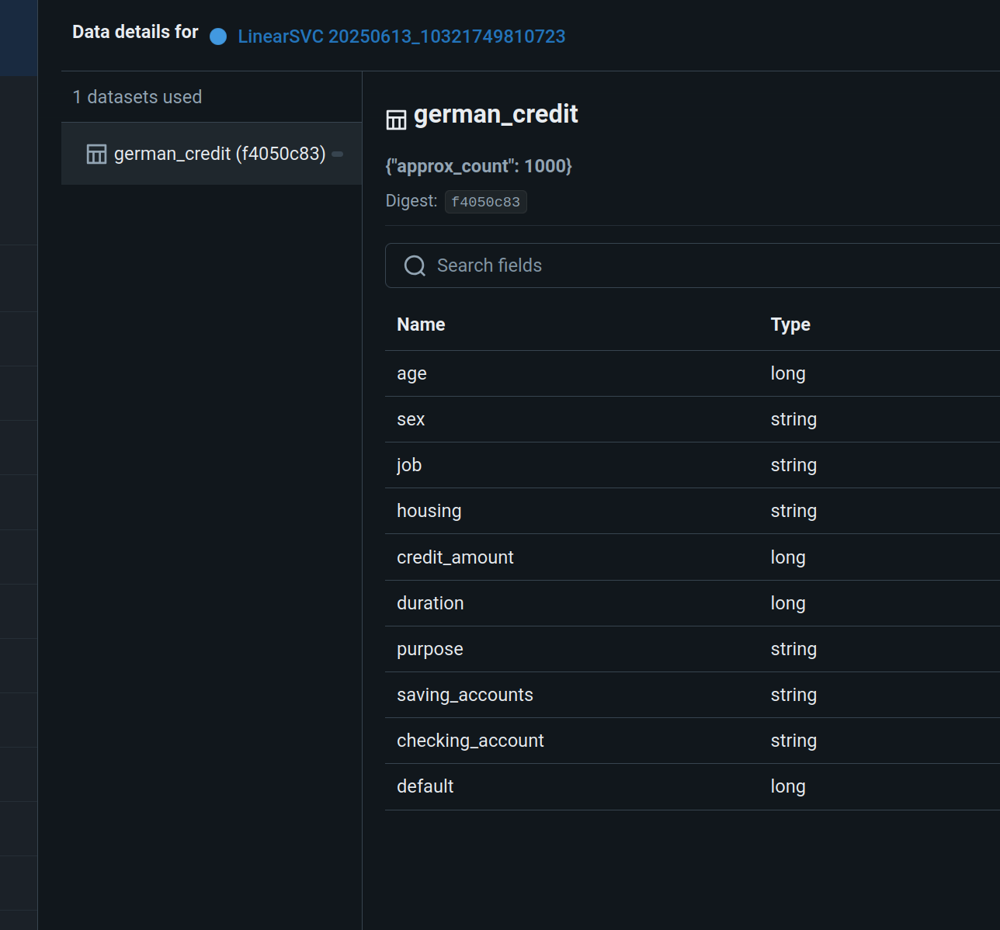

Also we log params and metrics, when runs cross validation tests

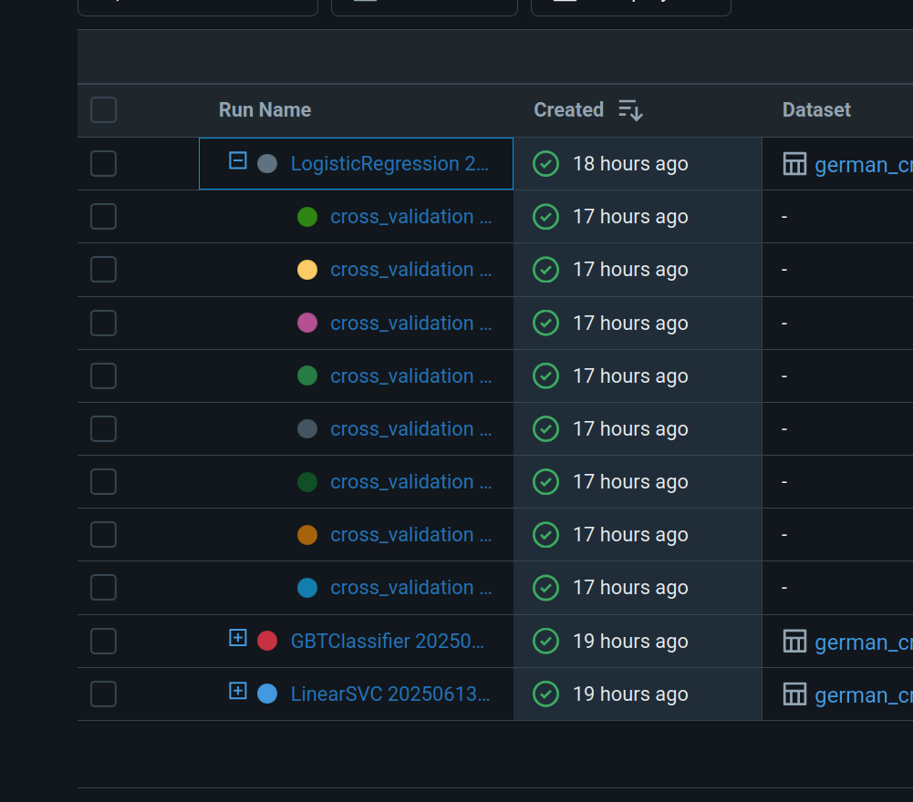

In mlflow we can compare runs by various metrics ..

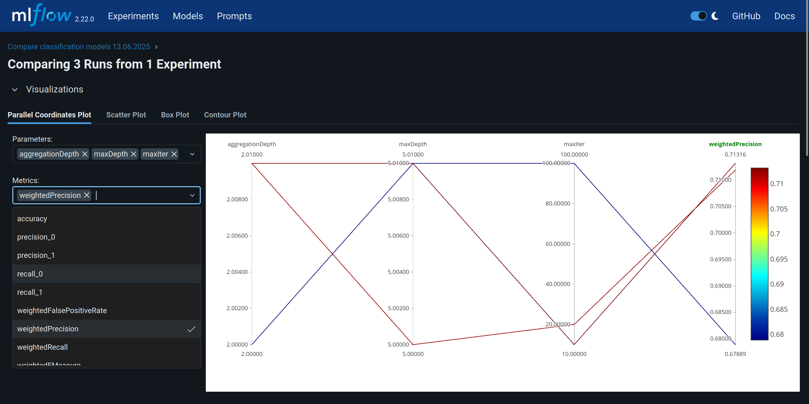

.. and register model we need to use

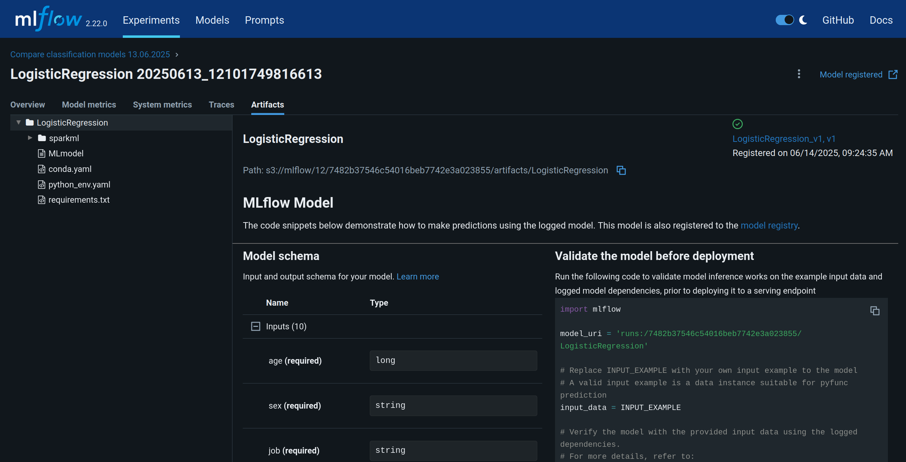

## Postresql database

Mlflow data save to database (we choose postgresql for this purpose)
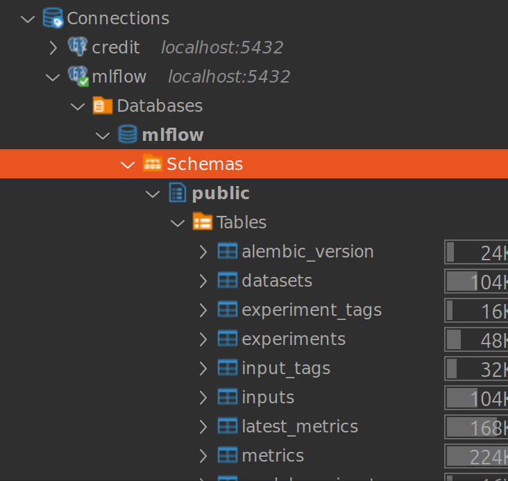

We can use all run's metrics and params from db to create data mart in metabase, as example.
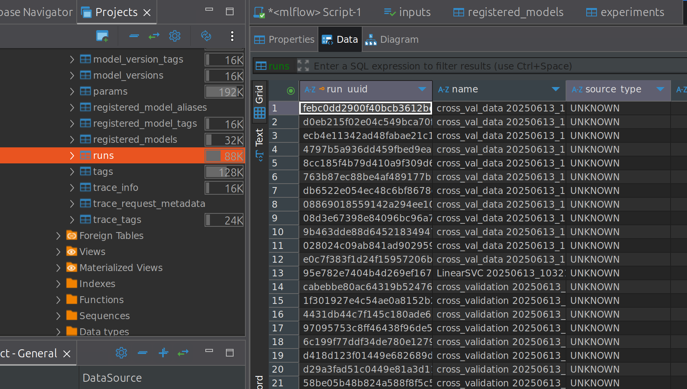

## Minio s3 storage

Mlflow store models to s3 storage (minio in our project). We create bucket for this purpose.
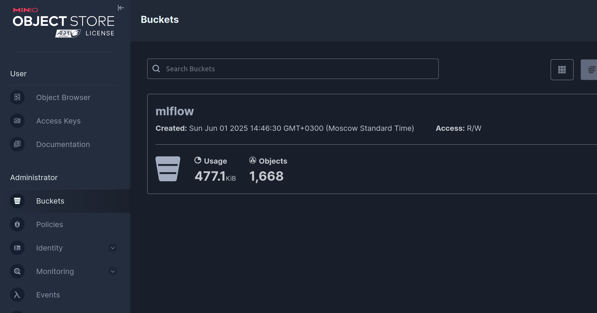

In bucket for every run we store all model's data
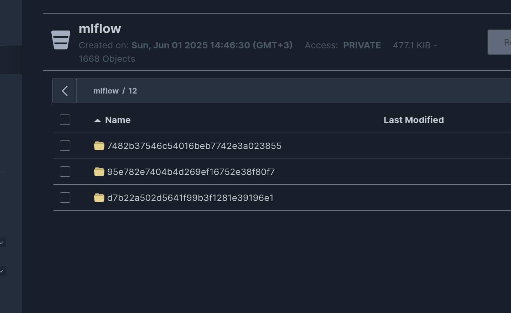

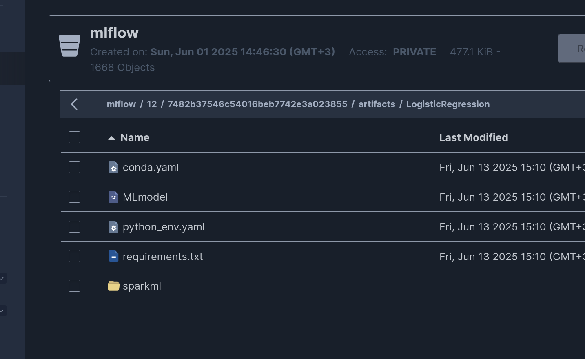

## Our models

### LinearSVC 
This binary classifier optimizes the Hinge Loss using the OWLQN optimizer. Only supports L2 regularization currently.
##### Hyperparameters we will use in crossvalidation:
- maxIter;
- tol;
- regParam.

### Gradient Boosted Trees Classifier (GBTClassifier)
It is a technique of producing an additive predictive model by combining various weak predictors, typically Decision Trees.

##### Hyperparameters we will use in crossvalidation:
- maxDepth;
- maxIter;
- validationTol.

### Logistic Regression
Logistic regression is a supervised learning algorithm that makes use of logistic functions to predict the probability of a binary outcome.

##### Hyperparameters we will use in crossvalidation:
- maxIter;
- regParam;
- aggregationDepth.

## Conclusion
> For our purpose in this dataset we will use LinearSVC model, becouse we need to classifier more exactly second class of label variable ("1"), and "precision_1" metric in this model is greater when all others.